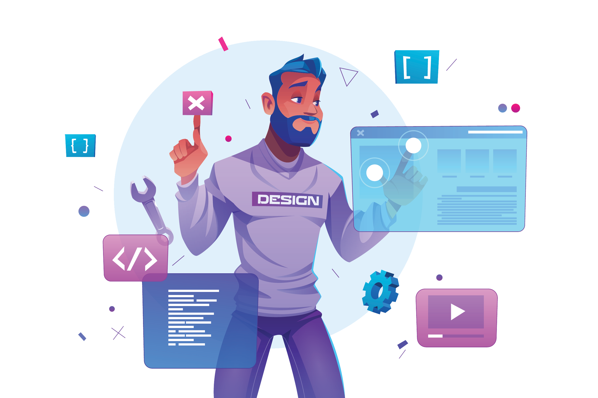

<!-- Your title -->
<h1 align="center">Hi there, Ashan Here! ✌️😄</h1>

 
   
  
  
  
  
  
  

<h3 align="center">Web Developer / Designer & Prospective Mobile Developer</h3>
 

<!-- Any image aligned to the right. Beware the width -->

<!-- Talking about you -->
**I'm currently improving on:**

-  Starting my grad-certificate studies in Mobile Solutions Development at Conestoga College, Waterloo, Ontario 🇨🇦 in May🎓 
-  Learning to build a CRM system using Node.js, Vue.js, MongoDB & GraphQL 💻
-  Want to start writing blog articles on things that interest me. 🖋️
**Languages and Tools:** 

   
   **Technologies I know:**

  
  <!-- Your languages and tools. Be careful with the alignment. 
  You can use this sites to get logos: https://www.vectorlogo.zone or https://simpleicons.org/
  -->
  <code></code>
   <code></code>
   <code></code>
   <code></code>
   <code></code> 
   <code></code> 
   <code></code> 
   <code></code> 
   <code></code> 
   

<a href='https://www.freepik.com/vectors/man' style="font-size: 8px">Man vector created by upklyak</a>

[github]: https://github.com/ashanub
[twitter]: https://twitter.com/ashanub
[instagram]: https://instagram.com/l____o_0____l/
[linkedin]: https://linkedin.com/in/ashanub
[email]: mailto:ashanudayanga@gmail.com

